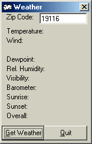



## weather\.ocx

### Description

This program will get local weather using your zip code anywhere in USA. The code can easily be modified to get the weather for the next day. Please tell me what you thing about this custom control and PLEASE vote for me :) :) :)
 
### More Info
 
zip code

add the ocx to your project then use weather1.getweather to load the weather and rest of the functions to get the other stuff. (ex: text1.text = weather1.gettemp that will load current temperature into text1)

temperature,wind,dewpoint,humidity,visibility,barometer reading,sunrise,sunset,overall weather

             |
---                |---
**Submitted On**   |2000-08-16 12:54:10
**By**             |[Izek](https://github.com/Planet-Source-Code/PSCIndex/blob/master/ByAuthor/izek.md)
**Level**          |Intermediate
**User Rating**    |5.0 (15 globes from 3 users)
**Compatibility**  |VB 6\.0
**Category**       |[Custom Controls/ Forms/  Menus](https://github.com/Planet-Source-Code/PSCIndex/blob/master/ByCategory/custom-controls-forms-menus__1-4.md)
**World**          |[Visual Basic](https://github.com/Planet-Source-Code/PSCIndex/blob/master/ByWorld/visual-basic.md)
**Archive File**   |[CODE\_UPLOAD90238172000\.zip](https://github.com/Planet-Source-Code/izek-weather-ocx__1-10739/archive/master.zip)

